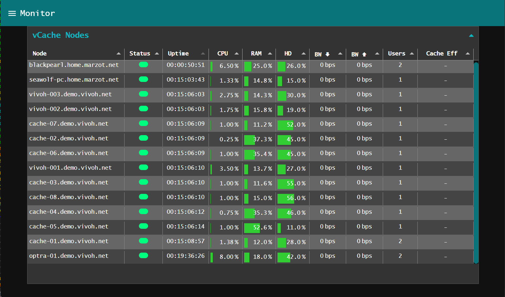
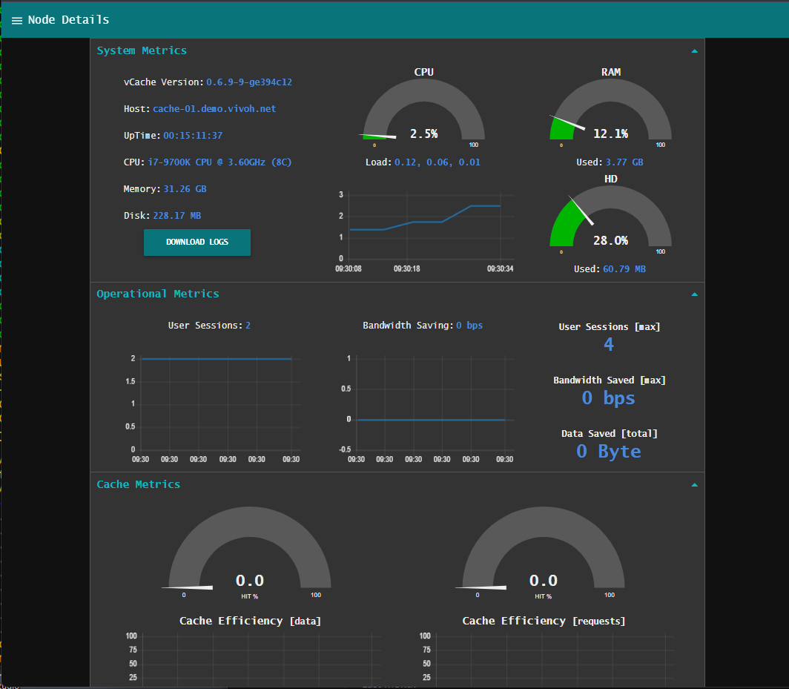
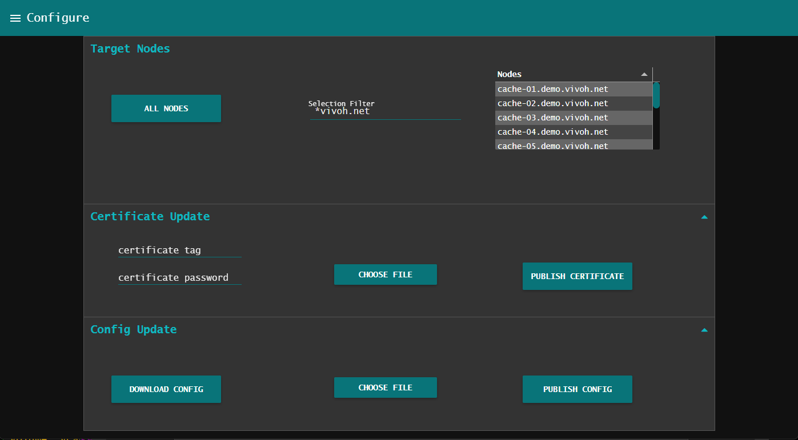
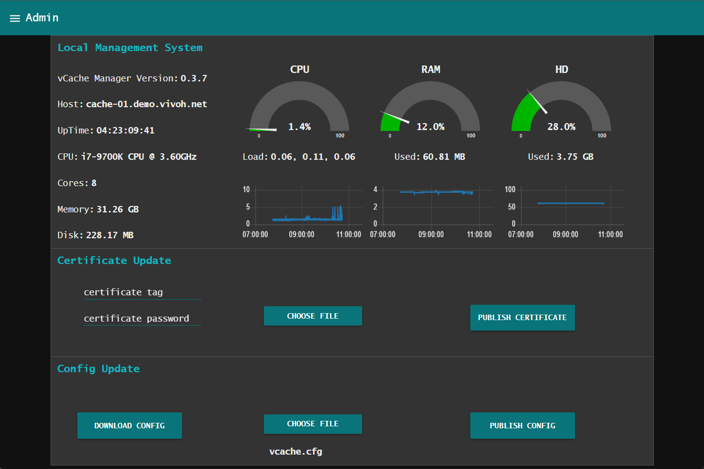

**vCache - High Performance, High Efficiency, Streaming-Video Proxy-Cache**

vCache is a containerized, custom integration, composed of several
open-source components, that implements a streaming-video
proxy-cache. It is a network-infrastructure traffic-management
application allowing large enterprises, institutions, or any network
environment with large numbers of viewers to consume streaming-video
(HLS, DASH, MSS, MP4, etc.) without saturating upstream networks. In
the absence of some enterprise CDN (eCDN) solution like vCache, WAN
and ISP connections can quickly become congested with video traffic
resulting in poor user experience, missed messaging, and potential
interference with other mission critical network applications.

The central component of vCache is the world-class CDN caching engine,
Varnish, used in combination with custom built nginx for frontend and
backend processing. vCache uses node-red for control-plane operation
and user-interface. Configuration, operational state, and metrics are
stored in a Redis DB.

vCache can integrate with most standard streaming video environments
in a number of ways. vCache has also been shown to work with a wide
variety of vendors and streaming platforms (e.g., Vimeo, Brightcove,
Kaltura, etc.). vCache supports a forward-proxy mode and reverse-proxy
mode. Basic load-balancing and configuration based routing is
supported via manifest re-write where possible. vCache has aslo been
integrated with NPAW CDN Balancer achieving resilient fault tolerant
load distribution.

vCache is designed for high performace, and high compute-efficiency,
and can run on minimal hardware with low power consumption while
maintaining high data throughput and requests per second. vCache ports
fairly easily to container based environments. It has been
successfully deployed on Lexmark's edge-compute platform, Optra,
Synology NAS, and other platforms that support "portainer".

vCache may run standalone or operate within a fleet of managed caches
via vCache-Manager (see vcache-manager repository). In the managed
mode, vCache uses the salt-stack for secure remote management. A bulk
deployment tool, vcache-deploy, is provided which supports SSH-based
mass-deployment.

Author: G. S. Marzot (gmarzot@marzresearch.net)

For additional information or demo please contact Vivoh (cache@vivoh.com)

# vcache-manager
vcache fleet management

./bin/vcache-mgr-start [-d|--debug]
./bin/vcache-mgr-stop [-r|--real-clean] [-c|--clean]

./bin/vcache-deploy [-?|--help] [-d|--debug] [-D|--dry-run] [f|--force]
                    [-u|--ssh-user <ssh-user>] [-p|--ssh-password <ssh-password>]
                    [-k|--ssh-key <ssh-key>] [-h|--ssh-host <ssh-host>]
                    [-m|--mgr-addr <mgr-addr>] [-g|--gen-keys] [-t|--target-dir]
                    [-r|--roster-file <roster-file>] [-C|--command-arg <cmd-arg>]*
                    (-i|--installer <installer> | -c|--command <cmd>*)
                    
./bin/vcache-deploy -i ../vcache/release/vcache-0.6.3.run -r vcache.roster -m 10.14.25.253 -g -C '-c' -C '4G' -C '-b' -C '-r'
./bin/vcache-deploy -r vcache.roster -c './vcache-0.6.3/bin/vcache-uninstall.sh'
